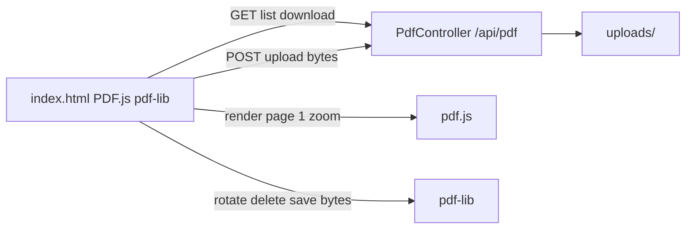

# Spring Boot + PDF.js file structure and approach

The app is already a working Maven Spring Boot service (`com.sdk:sdk`) with [`PdfController`](src/main/java/com/sdk/controller/PdfController.java) and a single-page UI at [`src/main/resources/static/index.html`](src/main/resources/static/index.html). The right architecture is **server = PDF file store**, **browser = viewer/editor SDK**. Do not parse or mutate PDFs in Java.



## Responsibility split

- **Spring Boot:** list `.pdf` files, stream bytes with `Content-Disposition: inline`, accept `MultipartFile` and `Files.copy(..., REPLACE_EXISTING)` under [`uploads/`](uploads/). Path-traversal checks stay on the server.
- **PDF.js (CDN 3.11.174):** load in-memory `ArrayBuffer` / `Uint8Array`, render page 1 to `#pdf-render`, apply scale for zoom.
- **pdf-lib (CDN 1.17.1):** rotate selected pages +90°, delete selected pages in **descending** index order, write new bytes back to memory, then `POST /api/pdf/upload`.
- **Print:** `URL.createObjectURL` + hidden iframe `print()`.

## Target file structure

Keep Maven defaults. Split the monolith HTML and pull I/O out of the controller.

```
sdk-app/
  pom.xml
  uploads/                          # runtime PDF store (not classpath)
  src/main/java/com/sdk/
    SdkApplication.java
    config/StorageProperties.java   # pdf.storage.dir=uploads
    service/PdfStorageService.java  # list / load Resource / save stream
    controller/PdfController.java   # /api/pdf only
  src/main/resources/
    application.properties
    static/
      index.html                    # layout + script tags only
      css/app.css
      js/api.js                     # list / download / upload
      js/viewer.js                  # pdf.js render + zoom + print
      js/editor.js                  # edit mode grid, Set selection, pdf-lib
      js/app.js                     # toolbar wiring, page load
  src/test/java/com/sdk/
    SdkApplicationTests.java
    controller/PdfControllerTests.java
```

Spring Boot serves `classpath:/static/` at `/`, so `index.html` is the app shell with no extra view controller.

## Backend approach

1. Add `pdf.storage.dir=uploads` in [`application.properties`](src/main/resources/application.properties) and bind it in `StorageProperties`.
2. Move filesystem logic from [`PdfController`](src/main/java/com/sdk/controller/PdfController.java) into `PdfStorageService` (`createDirectories` on startup, `resolveSafePath`, list `*.pdf`, `UrlResource` download, copy upload).
3. Keep the existing API contract (frontend already depends on it):

| Method | Path | Role |
|---|---|---|
| GET | `/api/pdf/list` | `List<String>` of `*.pdf` names |
| GET | `/api/pdf/download/{filename}` | PDF `Resource`, `application/pdf`, `inline` |
| POST | `/api/pdf/upload` | `file` part, replace existing, success string |

4. Optional hardening (small): multipart size limits, `@ControllerAdvice` for `IllegalArgumentException` → 400.

No Apache PDFBox / iText on the server unless you later add thumbnails or server-side merge. Viewing and editing stay in the browser.

## Frontend approach

1. [`index.html`](src/main/resources/static/index.html) keeps the toolbar (Edit Mode, Print, Zoom In/Out, Rotate Selected, Delete Selected, Save Document), sidebar `#file-list` + upload, and main toggle between `#pdf-render` and `#page-grid`.
2. `api.js`: `GET /api/pdf/list`, `GET /api/pdf/download/{filename}` → `ArrayBuffer`, `POST` `FormData` + `Blob`.
3. `viewer.js`: configure `pdfjsLib.GlobalWorkerOptions.workerSrc` to the 3.11.174 worker CDN; `getDocument({ data })`; render page 1; zoom via `scale`.
4. `editor.js`: `editMode` flag; grid of clickable page placeholders; `Set` of 0-based indexes; `PDFDocument.load` → mutate → `save()` → replace in-memory bytes → re-render.
5. `app.js`: fetch list on load, select file, wire buttons, print iframe.

Libraries stay on CDN as already specified (pdf.js + pdf-lib). No npm/frontend build.

## Runtime flow

1. Browser loads `/` → static `index.html`.
2. `GET /api/pdf/list` fills the sidebar.
3. User picks a file → bytes stay in JS state.
4. View mode: PDF.js draws page 1. Edit mode: placeholder grid + multi-select.
5. Rotate/delete update bytes in memory only until **Save Document** (or sidebar upload) posts to `/api/pdf/upload`.

## What not to add

- Server-side PDF rendering or a Java PDF SDK for this feature set.
- Auth, DB, or per-user storage unless requirements change.
- Rewriting the API paths; the current `/api/pdf/*` contract already matches the UI.
